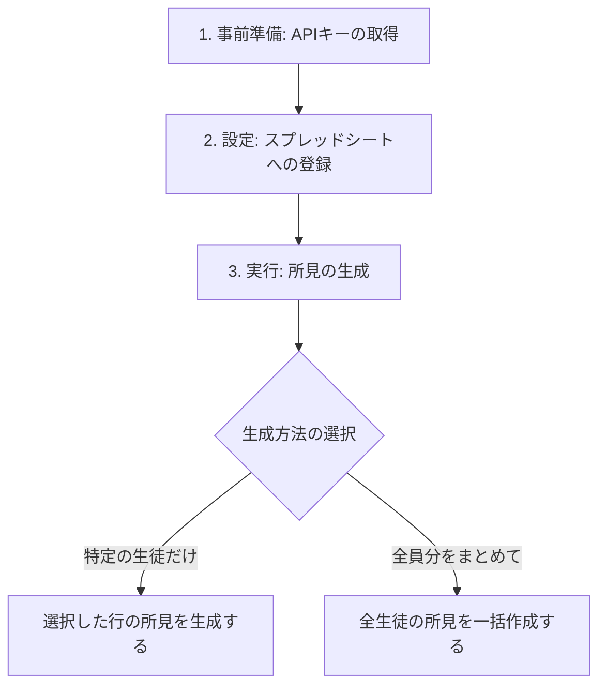

# 🌟 道徳所見生成システム（v7.13）取扱説明書

本システムは、Googleスプレッドシート上でGemini AIを活用し、児童の「振り返りメモ」や授業の「基本文」をベースに、通知表にそのまま使える道徳の所見文を自動生成するシステムです。

---

## 📋 全体の流れ
所見を作成する手順は、大きく分けて以下の**3ステップ**です。

---

## 🔑 1. 事前準備（APIキーの取得）
AIを動かすための「鍵」となる **Gemini APIキー** を取得します（無料です）。

### 💡 快適に使うための重要ポイント
> [!IMPORTANT]
> **異なるGoogleアカウントで作成したAPIキーを「3本」用意することを強くお勧めします。**
> * **理由:** Googleの無料枠制限により、1つのアカウントにつき「1分間に15回」までしかAIを呼び出せません。
> * **対策:** 学校で用意されている共有アカウントや個人のアカウントなど、**別々のGoogleアカウント**から1本ずつキーを取得し、計3本を登録することで、制限に引っかからず非常にスムーズに（約3倍の速度で）処理が進むようになります。

### APIキー取得手順（アカウントごとに行う）
1. ブラウザで **[Google AI Studio](https://aistudio.google.com/)** にアクセスします。
2. 画面左上の **「Get API key」** ボタンをクリックします。
3. **「Create API key」** をクリックします。
4. ポップアップが表示されたら、検索窓で「My First Project」などのプロジェクトを選択するか、新規作成して **「Create API key in existing project」** をクリックします。
5. 生成された `AIzaSy...` から始まる長い文字列をコピーし、メモ帳等に保存しておきます。

---

## ⚙️ 2. 設定シートへの登録

スプレッドシートの **「基礎データ」** シートを開き、設定を行います。

| セル位置 | 項目名 | 設定内容 |
| :--- | :--- | :--- |
| **B1** | **APIキー** | 取得したAPIキーを入力します。 ※複数登録する場合は、**カンマ（ `,` ）や改行で区切って**入力してください。 （例：`キー1, キー2, キー3`） **※入力後、エンターを押すと自動的に「登録済み (3本のキー)」とマスクされ、キーが保護されます。** |
| **B2** | **所見のモード / プロンプト** | 「120文字以内」「基本文重視」など、用途に合わせたプロンプトを選択・入力します。 |
| **B3** | **一括作成ステータス** | 一括作成時の進行状況やエラー情報が自動で表示されます（編集不要）。 |

---

## 🚀 3. 所見の生成方法

スプレッドシートのメニューバーに表示されている **「🌟道徳AI支援」** から実行します。

### 📌 パターンA：特定の生徒だけ作成・修正する
> [!TIP]
> 「メモを書き直した生徒だけ再生成したい」「少人数分だけサクッと作りたい」場合に最適です。

1. **「成長の様子」** シートを開きます。
2. 所見を作成・修正したい生徒の行（C列〜I列のどこでも可）をドラッグして選択します。
   * ※離れた行を選択する場合は、`Ctrl` キーを押しながらクリックします。
3. スプレッドシート上部メニューの **「🌟道徳AI支援」 ＞ 「選択した行の所見を生成する」** をクリックします。
4. 選択した行のD列（AI所見出力）に「（AIが執筆中...🖊️）」と表示され、順次書き込まれます。

---

### 📌 パターンB：クラス全員分を一括で作成する
> [!TIP]
> 途中でGoogleの実行時間制限（6分）になっても、システムが自動的に一時休止し、**数分後に続きから自動で再開**します。エラーが発生した行も自動でリトライされます。

1. **「成長の様子」** シートを開きます。
2. スプレッドシート上部メニューの **「🌟道徳AI支援」 ＞ 「全生徒の所見を一括作成する」** をクリックします。
3. 確認画面が表示されるので **「はい」** をクリックします。
4. バックグラウンドで順次生成が開始されます。スプレッドシートを閉じて別の作業をしていても、裏側で自動的に動き続けます。
5. すべて完了すると、「完了」のアラートが表示されます（基礎データシートのB3セルにも完了日時が表示されます）。

---

## 💾 4. バックアップの作成
万が一のデータ消失に備え、現在のシートのコピーを安全なフォルダに保存できます。

1. メニューの **「🌟道徳AI支援」 ＞ 「バックアップを作成する」** をクリックします。
2. スプレッドシートと同じGoogleドライブのフォルダ内に自動で「バックアップ」フォルダが作成され、実行した時点のデータが日付・時間付きのファイル名で保存されます。

---

## ❓ トラブルシューティング（よくある質問）

#### Q. 生成されたセルに「エラー: ...」と表示されました。どうすればいいですか？
> **A.** 主に以下の原因が考えられます。
> * **API利用制限（429 Too Many Requests）:** 無料枠のアクセス制限に達した場合に発生します。数分待つと自動的に制限が解除され、一括作成機能を使っている場合は自動的にリトライされます。
> * **対処法:** 「違うGoogleアカウントのAPIキー」を複数登録することで、このエラーをほぼ完全に回避できます。

#### Q. すでに手動で修正した所見が、再実行したときにAIに上書きされてしまいませんか？
> **A.** **上書きされません。**
> すでにD列（AI所見出力）に正常な文章（「エラー:」や「執筆中」以外で始まる文章）が書き込まれている行は、プログラムが「作成済み」と判断して自動的にスキップします。
> * **書き直したい場合:** 対象の生徒のD列のセルを空欄（Delキー等で消去）にしてから、再度実行してください。

#### Q. メモ（I列）が空欄の生徒がいますが、エラーになりますか？
> **A.** **エラーになりません。**
> メモがない場合は、「基本文」のみをベースにして自動的に自然な評価文に整えるようにAIが自動判別します。
